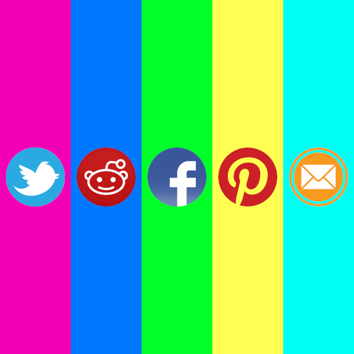

<!-- PROJECT LOGO -->
 

  

  <h1 align="center">BookmarkThis</h1>

  

    A PHP MODX Revolution extra to display social bookmarks and follow-me links.
     
     
    <a href="https://madaboutbrighton.net/projects/bookmarkthis">visit website</a>
    ·
    <a href="https://github.com/madaboutbrighton/bookmarkthis/issues">bug report</a>
    ·
    <a href="https://github.com/madaboutbrighton/bookmarkthis/issues">feature request</a>
  

Contents
  - [About The Project](#about-the-project)
  - [Installation](#installation)
  - [Usage](#usage)
  - [Options](#options)
  - [FAQ](#faq)

<!-- ABOUT THE PROJECT -->
## About The Project

[![BookmarkThis Screen Shot][screenshot1]](https://madaboutbrighton.net/projects/bookmarkthis)

BookmarkThis is a PHP MODX Revolution add-on to generate social buttons and links. The BookmarkThis package is made up of very light weight CSS and JavaScript. It is fully customisable, allowing you to add your own links and icons.

### Built With

  - [MODX](https://modx.com/)

## Installation

1. Log-in to your MODX Manager
2. Go to the Insaller
3. Search for BookmarkThis and instal

## Usage

The default BookmarkThis snippet displays a set of social buttons that a visitor can use to share your page.

### Including only certain items

The `use` property allows you to specify which items to show. Items returned will be in the same order that you specify them.

### Changing the size

The `size` property allows you set the size of the icons. You can currenlty choose from 16, 36, 48 and 64.

### Altering the style

The `type` property allows you set the style of the icons. You can currently choose from rounded, square, custom and circle.

[screenshot1]: _images/screenshot1.png
