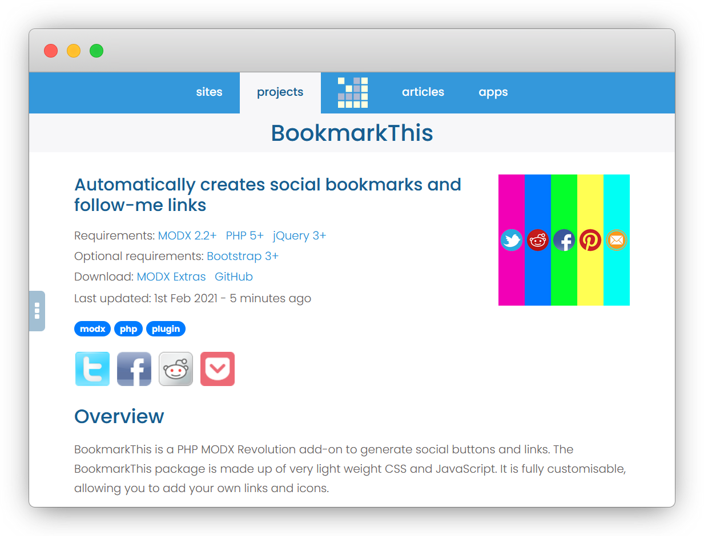

<!-- PROJECT LOGO -->

  

  <h1 align="center">BookmarkThis</h1>

  

    A PHP MODX Revolution extra to display social share and follow buttons
     
     
    <a href="https://madaboutbrighton.net/projects/bookmarkthis">visit website</a>
    ·
    <a href="https://github.com/madaboutbrighton/bookmarkthis/issues">bug report</a>
    ·
    <a href="https://github.com/madaboutbrighton/bookmarkthis/issues">feature request</a>
  

Contents
  - [About The Project](#about-the-project)
  - [Installation](#installation)
  - [Usage](#usage)
  - [Options](#options)

<!-- ABOUT THE PROJECT -->
## About The Project

BookmarkThis is a PHP MODX Revolution extra to display social share and follow buttons on your website. The BookmarkThis package is made up of several chunks and snippets, and includes very light weight CSS and JavaScript. It is fully customisable, allowing you to add your own links and icons.

### Built With

- [MODX](https://modx.com/)

## Installation

1. Log-in to your MODX Manager
2. Go to the Insaller
3. Search for BookmarkThis and instal

## Usage

### Share

The _BookmarkThis_ snippet displays a set of inline social share buttons. By default, all the buttons from the data chunk are shown, where a `share` property has been set.

#### Including only certain items

The `use` property allows you to specify which buttons to show. Buttons returned will be in the same order that you specify them.

#### Changing the size

The `size` property allows you set the size of the buttons. You can currenlty choose from _16_, _36_, _48_ and _64_.

#### Altering the style

The `type` property allows you set the style of the buttons. You can currently choose from _rounded_, _square_, _custom_ and _circle_.

##### Circle icons

##### Custom icons

### Follow

The _BookmarkThisFollow_ snippet displays a set of inline social follow buttons. By default, all the buttons from the data chunk are shown, where a `follow` property has been set.

## Options

### Share

The share options are set on the _BookmarkThis_ snippet.

Property | Description | Default
------ | ------|----------
`use` | Comma separated list of items to be used from the data. If empty, all data items will be used. | &nbsp;
`exclude` | Comma separated list of items to be excluded from the data. | &nbsp;
`data` | Name of chunk containing the JSON data items. | _bookmarkThisData_
`type` | Type of icon to be used. Either - _circle_, _rounded_, _custom_ or _square_ | _rounded_
`size` | Size of icon to be used. Either - _16_, _36_, _48_ or _64_ | _36_
`tpl` | Name of chunk to apply to each item. | _bookmarkThisShare_
`tplWrapper` | Name of chunk to wrap all `tpl` items inside. | _bookmarkThisShareWrapper_
`appendJS` | Whether to append the JavaScript to the end of the resource output. | _1_
`appendCSS` | Whether to append the CSS to the end of the resource head. | _1_
`customFields` | JSON data specifying the queries and attributes from which to obtain a bookmarklets _title_, _description_ and _tags_. | &nbsp;

### Follow

The follow options are set on the _BookmarkThisFollow_ snippet.

Property | Description | Default
------ | ------|----------
`use` | Comma separated list of items to be used from the data. If empty, all data items will be used. | &nbsp;
`exclude` | Comma separated list of items to be excluded from the data. | &nbsp;
`data` | Name of chunk containing the JSON data items. | _bookmarkThisData_
`type` | Type of icon to be used. Either - _circle_, _rounded_, _custom_ or _square_ | _rounded_
`size` | Size of icon to be used. Either - _16_, _36_, _48_ or _64_ | _36_
`tpl` | Name of chunk to apply to each item. | _bookmarkThisFollow_
`tplWrapper` | Name of chunk to wrap all `tpl` items inside. | _bookmarkThisFollowWrapper_
`appendCSS` | Whether to append the CSS to the end of the resource head. | _1_