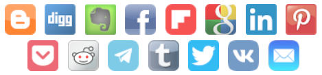
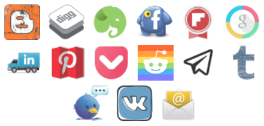

<p align="center">
  

  <h1 align="center">BookmarkThis</h1>

  <p align="center">
    A MODX Revolution extra to display social share and follow buttons
    <br />
    <br />
    <a href="https://madaboutbrighton.net/projects/bookmarkthis">website</a>
    ·
    <a href="https://github.com/madaboutbrighton/bookmarkthis/issues">bugs</a>
    ·
    <a href="https://github.com/madaboutbrighton/bookmarkthis/issues">requests</a>
  </p>
</p>

Contents
  - [About The Project](#about-the-project)
  - [Installation](#installation)
  - [Usage](#usage)
  - [Examples](#examples)
  - [Options](#options)
  - [Customise](#customise)

## About The Project


BookmarkThis is a MODX Revolution extra that displays inline social share and follow buttons on your website. The BookmarkThis package is made up of several chunks and snippets, and includes very light weight CSS and JavaScript. It is fully customisable, allowing you to add your own links and icons.

### Built With

- [MODX](https://modx.com/)

## Installation

1. Log-in to your MODX Manager
2. Go to the Insaller
3. Search for BookmarkThis and instal

## Usage

### Share

Use the _BookmarkThis_ snippet to dispaly inline social share buttons. By default, all the buttons from the data chunk are shown, where a `share` property has been set.



### Follow

Use the _BookmarkThisFollow_ snippet to dispaly inline social follow buttons. By default, all the buttons from the data chunk are shown, where a `follow` property has been set.


## Examples

### Including only certain items

The `use` property allows you to specify which buttons to show. Buttons returned will be in the same order that you specify them.


### Changing the size

The `size` property allows you set the size of the buttons. You can currenlty choose from _16_, _36_, _48_ and _64_.


### Altering the style

The `type` property allows you set the style of the buttons. You can currently choose from _rounded_, _square_, _custom_ and _circle_.

#### Circle icons


#### Custom icons



## Options

### Share

The share options are set on the _BookmarkThis_ snippet.

Property | Description | Default
------ | ------|----------
`use` | Comma separated list of items to be used from the data. If empty, all data items will be used. | &nbsp;
`exclude` | Comma separated list of items to be excluded from the data. | &nbsp;
`data` | Name of chunk containing the JSON data items. | _bookmarkThisData_
`type` | Type of icon to be used. Either - _circle_, _rounded_, _custom_ or _square_ | _rounded_
`size` | Size of icon to be used. Either - _16_, _36_, _48_ or _64_ | _36_
`tpl` | Name of chunk to apply to each item. | _bookmarkThisShare_
`tplWrapper` | Name of chunk to wrap all `tpl` items inside. | _bookmarkThisShareWrapper_
`appendJS` | Whether to append the JavaScript to the end of the resource output. | _1_
`appendCSS` | Whether to append the CSS to the end of the resource head. | _1_
`customFields` | JSON data specifying the queries and attributes from which to obtain a bookmarklets _title_, _description_ and _tags_. | &nbsp;

### Follow

The follow options are set on the _BookmarkThisFollow_ snippet.

Property | Description | Default
------ | ------|----------
`use` | Comma separated list of items to be used from the data. If empty, all data items will be used. | &nbsp;
`exclude` | Comma separated list of items to be excluded from the data. | &nbsp;
`data` | Name of chunk containing the JSON data items. | _bookmarkThisData_
`type` | Type of icon to be used. Either - _circle_, _rounded_, _custom_ or _square_ | _rounded_
`size` | Size of icon to be used. Either - _16_, _36_, _48_ or _64_ | _36_
`tpl` | Name of chunk to apply to each item. | _bookmarkThisFollow_
`tplWrapper` | Name of chunk to wrap all `tpl` items inside. | _bookmarkThisFollowWrapper_
`appendCSS` | Whether to append the CSS to the end of the resource head. | _1_

## Customise

### Button data

You can edit existing social buttons, or add your own ones. The data for the buttons is stored in a chunk named _BookmarkThisData_. To customise BookmarkThis, simply create your own chunk with the same name. You can then apply your changes to this new data chunk.

Here's an example of the data within _BookmarkThisData_.

```json
{
  "facebook":{
      "name" : "Facebook",
      "share" : "https://www.facebook.com/sharer/sharer.php?u={link}&t={title}",
      "follow" : "https://www.facebook.com/",
      "image" : "{bookmarkthis_assets_url}images/v1.8/{size}/facebook-{type}.png"
    },
  "github":{
      "name" : "Github",
      "follow" : "https://github.com/",
      "image" : "{bookmarkthis_assets_url}images/v1.8/{size}/github-{type}.png"
    }, 
  "pinterest":{
      "name" : "Pinterest",
      "share" : "https://www.pinterest.com/pin/create/button?url={link}&media=&description={title}",
      "follow" : "https://www.pinterest.com/",
      "image" : "{bookmarkthis_assets_url}images/v1.8/{size}/pinterest-{type}.png"
    },
  "email":{
      "name" : "E-mail",
      "share" : "mailto:?subject={title}&body={link}",
      "image" : "{bookmarkthis_assets_url}images/v1.8/{size}/email-{type}.png"
    }
}
```

### Button style

All the styles used are prefixed with _bookmarkThis_. Simply extend these styles in your own css.

## Templates

All the teamplate chunks used by BookmarkThis can be customised by making your own one with the same name.

### Share

Each share button is rendered using a chunk named _BookmarkThisShare_, as defined by the `tpl` property.
    
```html

```

Each set of share buttons are rendered using a chunk named _BookmarkThisShareWrapper_, as defined by the `tplWrapper` property.

```html
<p class="bookmarkThisShare">[[+items]]</p>
```   

### Follow

Each follow button is rendered using a chunk named _BookmarkThisFollow_, as defined by the `tpl` property.
    
```html
<a href="[[+follow]]" title="Follow us on [[+name]]" rel="nofollow"></a>
```

### Wrapper template

Each set of follow buttons are rendered using a chunk named _BookmarkThisFollowWrapper_, as defined by the `tplWrapper` property.

```html
<p class="bookmarkThisFollow">[[+items]]</p>
```   
